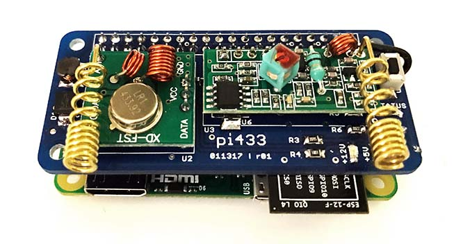
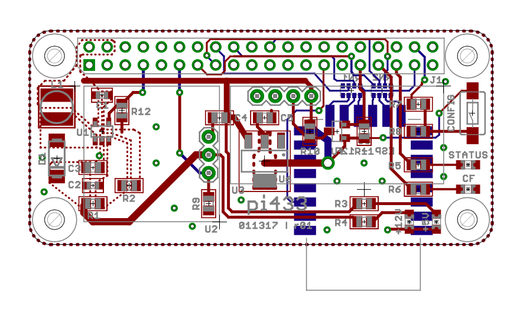

# pi433

Raspberry Pi Zero-based Etekcity 433 MHz wireless outlet control. Repo contains
control code and PCB designs.

## Features

* On/off control of Etekcity 433 MHz outlets
* Configurable via a single JSON file
* Ability to group switches into functional groups (e.g., "living room lights")
* Integration with Amazon Echo voice control
* RESTful API exposes outlet control
* Lightweight mobile frontend for manual control

## Dependencies

* [C] wiringPi
* [Python] Cython [optional]
* [Python] gevent
* [Python] rpi.GPIO

## Installation

The latest Rasbian image should include several of the dependencies, including
`RPi-GPIO` and `wiringPi`. The wifi on the Pi zero daughterboard is provided
by an ESP-12F that the Broadcom chip talks to over an SDIO interface. Here
are instructions for updating the device tree & recompiling the kernal to
support the ESP-12F: https://oshlab.com/esp8266-raspberry-pi-gpio-wifi/

After following the above instructions just set up wifi as usual by editing
`/etc/network/interfaces` and `/etc/wpa_supplicant/wpa_supplicant.conf`.

Next install the remaining python dependencies. I would recommend using
`apt-get` rather than `pip` (to avoid compile times) if you don't mind
installing in your system site packages directory.

Finally:

`sudo python install.py`
_(admin privileges necessary to install systemd service)_

## Installation notes

`pi433` is tested on Raspian under the system Python (2.7.7) / in a
virtual env. `pi433` is not installed into the Python site packages
directory, but rather is copied into `~/.pi433`. The install script copies
the main module directory along with the cli into `~/.pi433` and creates /
configures the `systemd` service necessary to run `pi433` at startup.

The repo contains a pre-built version of the Cython wrapper for the rc-switch
library, so unless you make modifications you shouldn't need Cython. (although
if you do need it, make sure you install via `sudo apt-get install cython`
to avoid the lonnnngg build time you'll experience through `pip`).

## Configuration

The included `config.json` file is also copies into `~/.pi433` and contains
the specifications for the RF outlets / groups that you want to control.

## Todo

* Include RF sniffing interface
* Implement config button functionality
* Better antenna for TX

## Licensing

All code is released under the MIT license with the exception of:

* Unmodified source code from rc-switch is LGPL v2.1:

        pi433/RCSwitch.cpp
        pi433/RCSwitch.h

## Acknowledgements

Inspired by (and derived from [see code comments]):
* rc-switch - https://github.com/sui77/rc-switch
* fauxmo - https://github.com/makermusings/fauxmo / https://github.com/n8henrie/fauxmo
